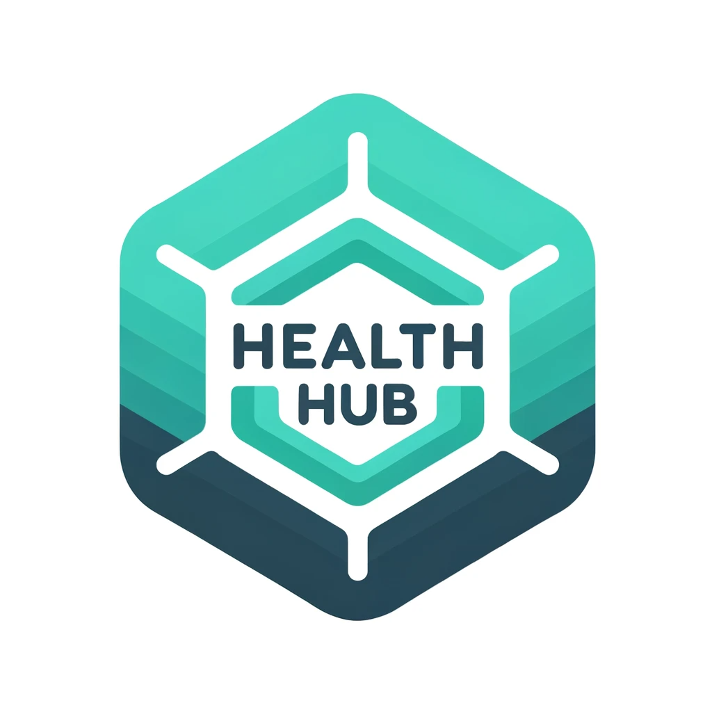

# HealthHub - Revolutionizing Healthcare

## Authors

HealthHub is developed by Spiescu Claudiu, Nenciu David, Barbu Bogdan-Florin

## Table of Contents

- Project Overview
- Key Features of the User App
- Cool Secondary Features for the User App
- Feature of the Lifesaver App
- MLH Side-Tracks

---

## Project Overview 

HealthHub is an ambitious project aimed at transforming the healthcare landscape. It's an all-encompassing solution designed to improve health monitoring, diagnosis, and emergency response. Our mission is to empower individuals to take control of their health and well-being by providing innovative tools and features.

### Goals

- Improve Health Monitoring
- Enhance Diagnosis
- Streamline Prescriptions
- Facilitate Emergency Response

### Significance

HealthHub addresses critical healthcare challenges, including delayed diagnosis, prescription mismanagement, and accessibility of vital health information during emergencies.

### Vision

Our vision is a future where everyone has easy access to advanced health management tools, leading to healthier lives and improved overall well-being.

---

## Key Features of the User App

### Feature 1: Advanced AI Diagnosis

HealthHub's User App utilizes machine learning algorithms to analyze CT scans and X-rays, enabling early detection of anomalies that could lead to diseases such as cancer and pneumonia.

### Feature 2: Bloodwork Analysis

Our app interprets bloodwork results, identifying values that deviate from the norm and suggesting possible underlying health conditions.

### Feature 3: Prescriptions Management

Users can seamlessly manage prescriptions from family doctors or specialist physicians using the User App.

### Feature 4: NFC Tag for Emergency

Attach vital information to an NFC tag for quick access during medical emergencies, ensuring first responders have crucial data.

---

## Cool Secondary Features for the User App

### Pill Management and Reminders

Easily manage medication with pill management tools and set reminders for pill intake.

### Medical History Tracking

Track your health journey with a comprehensive medical history log, visualizing improvements and trends over time.

### Future Implementations: Health Status Graphs

Plans include introducing health status graphs and providing users with insightful visual representations of their health trends.

---

## Feature of the Lifesaver App

### Lifesaver App Feature: NFC Vital Info Scanner

In emergencies, the Lifesaver App's NFC scanner retrieves and displays essential health information from an individual's NFC tag, providing critical data to first responders.

---

## MLH Side-Tracks

### Most Creative Use of GitHub:

HealthHub stands out as a prime example of how GitHub can be ingeniously employed to maintain a meticulously organized development environment. Within the GitHub platform, our project has orchestrated a symphony of structured code repositories, ensuring that every aspect of HealthHub is thoughtfully organized. This approach not only promotes code clarity but also fosters an environment where developers, healthcare professionals, and data scientists seamlessly collaborate. By harnessing GitHub's collaborative capabilities, we have curated a harmonious ecosystem for healthcare innovation. In this organized realm, ideas flourish, are rigorously tested, and evolve into refined solutions. The creative use of GitHub has not only streamlined our development process but has also empowered individuals to actively shape the future of healthcare technology within a structured and coherent framework.

### Best Use of Google Cloud:

HealthHub's integration with Google Cloud showcases our commitment to harnessing cutting-edge technology for the betterment of healthcare. By leveraging Google Cloud's powerful infrastructure, we have created a secure and scalable platform that can handle vast amounts of health data efficiently. Our use of Google Cloud's machine learning and data analytics tools has enabled us to develop advanced diagnostic algorithms, providing users with accurate health insights. We have harnessed the full potential of Google Cloud's resources to ensure that HealthHub delivers the highest level of performance and precision, making it a standout example of the best use of cloud technology in healthcare innovation.

### Most Innovative Startup Idea:

HealthHub embodies the spirit of innovation with its groundbreaking approach to healthcare. Our startup idea is not just about building another healthcare app; it's about redefining the way individuals interact with their health. We have introduced novel concepts such as AI-driven diagnosis, NFC-enabled emergency response, and collaborative data sharing with healthcare institutions. Our vision for HealthHub extends beyond convenience; it's about empowering individuals to take control of their health like never before. We have disrupted traditional healthcare paradigms by focusing on preventive care, early disease detection, and user-centric design. HealthHub is not just an app; it's a visionary startup idea that has the potential to transform the entire healthcare industry.

---
